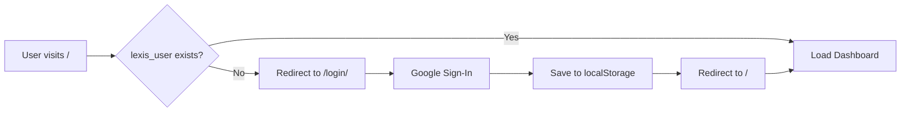

# 🎓 Lexis – AI Study Assistant

<div align="center">


**Transform your lectures into intelligent study materials**

[Live Demo](https://lexis-phi.vercel.app/index.html) • [GitHub](https://github.com/broskell/Lexis) • [Report Bug](https://github.com/broskell/Lexis/issues)

[](https://github.com/broskell/Lexis)
[](https://lexis-phi.vercel.app/)
[](LICENSE)

</div>

---

## 📖 Overview

**Lexis** is a cutting-edge, browser-based AI study assistant that revolutionizes how students learn. By leveraging real-time speech recognition and advanced AI processing, Lexis automatically converts live lectures into comprehensive, organized study materials—all within seconds.

Whether you're in a classroom, watching an online lecture, or reviewing recorded content, Lexis helps you focus on learning while it handles the note-taking.

### ✨ Key Highlights

- 🎙️ **Live Lecture Capture** – Real-time speech-to-text transcription
- 🤖 **AI-Powered Generation** – Automatic notes, summaries, quizzes, and flashcards
- 🧠 **Smart Mindmaps** – Visual representation of lecture concepts
- 💬 **Interactive Chat** – Ask questions about your lessons anytime
- 🔐 **Secure Authentication** – Google Sign-In with Firebase
- 💾 **Local Storage** – All your data stays with you
- 🌐 **100% Browser-Based** – No installations required

---

## 🚀 Features

### 1. 🎙️ Live Lecture Capture

Lexis uses the **Web Speech API** to convert your microphone input into text in real-time:

- **Continuous Recording** – Capture entire lectures without interruption
- **Auto-Save** – Transcripts are automatically saved to local storage
- **Manual Input** – Type or paste transcripts for browsers without speech support
- **Instant Processing** – Stop recording to trigger AI generation

### 2. 🧠 AI-Enhanced Study Materials

Powered by **Groq's LLaMA models**, Lexis automatically generates:

#### 📝 **Notes**
- Structured, bullet-point summaries
- Key concepts highlighted
- Easy to review and edit

#### 📊 **Summary**
- Concise 3-8 bullet-point overview
- Essential takeaways
- Quick revision material

#### 🗺️ **Mindmap**
- Visual concept hierarchy
- Topic and subtopic relationships
- Interactive exploration

#### ❓ **Quiz**
- Auto-generated questions
- Multiple-choice format
- Fill-in-the-blank questions
- Self-assessment tool

#### 🃏 **Flashcards**
- Front: Key term or concept
- Back: Detailed explanation
- Perfect for memorization

### 3. 📚 Lessons Workspace

A beautiful, organized dashboard for all your learning materials:

- **Sidebar Navigation** – Quick access to all lessons
- **Lesson Metadata** – Title, subject, creation date
- **Tabbed Interface** – Switch between notes, summary, transcript, mindmap, quiz, and flashcards
- **Edit Capabilities** – Modify notes and transcripts on the fly
- **Search & Filter** – Find specific lessons quickly

### 4. 💬 Floating "Ask Lexis" Chat

An intelligent assistant always ready to help:

- **Context-Aware** – Understands your current lesson
- **Persistent History** – Chat saved per lesson
- **Floating Bubble** – Non-intrusive, always accessible
- **Notification Badge** – See unread messages at a glance

### 5. 🔐 Secure Authentication

Firebase-powered authentication ensures your data is protected:

- **Google Sign-In** – One-click authentication
- **User Profiles** – Personalized experience
- **Session Management** – Automatic login persistence
- **Secure Logout** – Easy sign-out functionality

---

## 🎨 Screenshots

### Login Page
Beautiful, animated login experience with Google Sign-In integration.


### Main Dashboard
Clean, modern interface with sidebar navigation and tabbed content panels.


### Mindmap View
Visual representation of lecture concepts in an interactive format.


### Chat Interface
Floating chat bubble for quick questions and AI assistance.

---

## 🛠️ Tech Stack

| Category | Technology |
|----------|-----------|
| **Frontend** | HTML5, CSS3, Vanilla JavaScript |
| **Authentication** | Firebase Authentication |
| **AI/ML** | Groq (LLaMA 3.1 70B) |
| **Speech Recognition** | Web Speech API |
| **Storage** | LocalStorage API |
| **Hosting** | Vercel |
| **Version Control** | Git, GitHub |

---

## 📂 Project Structure

```
Lexis/
├── index.html              # Main dashboard
├── style.css               # Main app styling
├── script.js               # Core application logic
│
├── login/
│   ├── index.html          # Authentication page
│   ├── style.css           # Login page styling
│   └── script.js           # Firebase Auth logic
│
├── Assets/
│   └── chat_interface.png # Chat Interface
│   └── lexis-html-logo.png # Application logo
│   └── login-page.png # Login Page
│   └── main_dashboard.png # Main Dashboard
│   └── mindmap.png # Mindmap
│
└── README.md               # Documentation
```

---

## 🚦 Getting Started

### Prerequisites

Before you begin, ensure you have:

- ✅ A modern web browser (Chrome or Edge recommended)
- ✅ Node.js (for local development server)
- ✅ A Firebase account
- ✅ (Optional) A Groq API account

### Installation & Setup

#### 1️⃣ Clone the Repository

```bash
git clone https://github.com/broskell/Lexis.git
cd Lexis
```

#### 2️⃣ Configure Firebase Authentication

1. **Create a Firebase Project**
   - Go to [Firebase Console](https://console.firebase.google.com/)
   - Click "Add Project" and follow the setup wizard

2. **Enable Google Sign-In**
   - Navigate to **Authentication** → **Sign-in method**
   - Enable **Google** provider
   - Add authorized domains:
     - `localhost` (for development)
     - `lexis-phi.vercel.app` (or your domain)

3. **Get Your Firebase Config**
   - Go to **Project Settings** → **General**
   - Scroll to "Your apps" and select Web
   - Copy the configuration object

4. **Update `login/script.js`**

```javascript
const firebaseConfig = {
  apiKey: "YOUR_API_KEY",
  authDomain: "YOUR_AUTH_DOMAIN",
  projectId: "YOUR_PROJECT_ID",
  storageBucket: "YOUR_STORAGE_BUCKET",
  messagingSenderId: "YOUR_SENDER_ID",
  appId: "YOUR_APP_ID"
};
```

#### 3️⃣ (Optional) Configure Groq AI

**⚠️ Security Notice:** Never commit API keys to your repository!

For local testing only:

```javascript
// In script.js (line ~16)
const GROQ_API_KEY = "YOUR_GROQ_API_KEY";
const GROQ_MODEL = "llama-3.1-70b-versatile";
```

**For Production:** Use Vercel serverless functions or environment variables.

#### 4️⃣ Run Locally

Using `npx serve`:

```bash
npx serve .
```

Or using Python:

```bash
python -m http.server 5500
```

Then navigate to:
- **Main App:** `http://localhost:3000/`
- **Login:** `http://localhost:3000/login/`

---

## 🌐 Deployment

### Deploy to Vercel

1. **Push to GitHub**
   ```bash
   git add .
   git commit -m "Initial commit"
   git push origin main
   ```

2. **Connect to Vercel**
   - Go to [Vercel Dashboard](https://vercel.com/dashboard)
   - Click "New Project"
   - Import your GitHub repository
   - Configure:
     - **Framework Preset:** Other
     - **Build Command:** (leave empty)
     - **Output Directory:** `.`

3. **Add Environment Variables** (Optional)
   - `GROQ_API_KEY` – Your Groq API key
   - Add via Vercel Dashboard → Settings → Environment Variables

4. **Deploy**
   - Click "Deploy"
   - Your app will be live at `https://your-project.vercel.app/`

---

## 🔐 Authentication Flow

### How It Works



### Implementation

**Main App (`script.js`):**
```javascript
const rawUser = localStorage.getItem("lexis_user");
if (!rawUser) {
  window.location.replace("/login/");
  return;
}
```

**Login Page (`login/script.js`):**
```javascript
const result = await auth.signInWithPopup(provider);
const user = result.user;

localStorage.setItem("lexis_user", JSON.stringify({
  uid: user.uid,
  email: user.email,
  displayName: user.displayName,
  photoURL: user.photoURL
}));

window.location.href = "/";
```

**Sign Out:**
```javascript
function signOut() {
  localStorage.removeItem("lexis_user");
  firebase.auth().signOut();
  window.location.href = "/login/";
}
```

---

## 🌍 Browser Compatibility

### Fully Supported ✅

- **Chrome** (Desktop & Mobile)
- **Edge** (Desktop & Mobile)
- **Brave** (Desktop & Mobile)
- **Opera** (Desktop)

### Partially Supported ⚠️

- **Safari** (iOS & macOS) – Manual transcript entry only
- **Firefox** – Manual transcript entry only

### Speech Recognition Limitations

The **Web Speech API** is required for live recording:

```javascript
const SpeechRecognition = 
  window.SpeechRecognition || window.webkitSpeechRecognition;

if (!SpeechRecognition) {
  alert("Speech recognition not supported. Please use Chrome or Edge, or enter transcripts manually.");
}
```

---

## 🔒 Security Best Practices

### What We Do

✅ **No API Keys in Code** – All sensitive keys are environment variables  
✅ **Firebase Security Rules** – Proper authentication and authorization  
✅ **HTTPS Only** – All communications encrypted  
✅ **Input Validation** – Sanitized user inputs  
✅ **localStorage Encryption** – User data stored securely  

### What You Should Do

⚠️ **Never commit API keys** to the repository  
⚠️ **Rotate keys immediately** if accidentally exposed  
⚠️ **Use environment variables** for all sensitive data  
⚠️ **Enable GitHub secret scanning** to catch accidental commits  

### If You Accidentally Commit a Key

1. **Rotate the key** in your provider's dashboard
2. **Remove from Git history:**
   ```bash
   # Nuclear option (for small repos)
   rm -rf .git
   git init
   git add .
   git commit -m "Initial commit (cleaned)"
   git remote add origin <your-repo>
   git push -f origin main
   ```
3. **Use Git-filter-repo for larger repos**

---

## 🗺️ Roadmap

### Coming Soon 🚀

- [ ] **Cloud Sync** – Firestore integration for cross-device access
- [ ] **Real AI Chat** – Groq-powered contextual Q&A
- [ ] **Advanced Quiz Mode** – Scoring, explanations, and review
- [ ] **Mobile PWA** – Install as a native app
- [ ] **Collaborative Study** – Share lessons with classmates
- [ ] **Export Options** – PDF, DOCX, and more
- [ ] **Voice Commands** – Control Lexis hands-free
- [ ] **Multi-language Support** – Learn in any language

### Future Ideas 💡

- Spaced repetition algorithm for flashcards
- Integration with popular LMS platforms
- Offline mode with ServiceWorker
- Custom AI model training per user
- Analytics dashboard for study habits

---

## 🤝 Contributing

We welcome contributions from the community! Here's how you can help:

### Ways to Contribute

- 🐛 **Report bugs** – Found an issue? Let us know!
- 💡 **Suggest features** – Have an idea? Share it!
- 📝 **Improve docs** – Help others understand Lexis
- 🔧 **Submit PRs** – Fix bugs or add features
- ⭐ **Star the repo** – Show your support!

### Development Guidelines

1. Fork the repository
2. Create a feature branch (`git checkout -b feature/AmazingFeature`)
3. Commit your changes (`git commit -m 'Add AmazingFeature'`)
4. Push to the branch (`git push origin feature/AmazingFeature`)
5. Open a Pull Request

---

## 📄 License

This project is licensed under the **MIT License** – see the [LICENSE](LICENSE) file for details.

---

## 👥 Team

**Lexis** is built with ❤️ by the **Lexis Team**:

<table>
  <tr>
    <td align="center">
      <a href="https://github.com/broskell">
        <br />
        <sub><b>Saathvik</b></sub>
      </a><br />
      <sub>Lead Developer</sub>
    </td>
    <td align="center">
      <a href="https://github.com/shivakumar-dev-11">
        <br />
        <sub><b>Shiva</b></sub>
      </a><br />
      <sub>Login Page Developer</sub>
    </td>
  </tr>
</table>

### Special Thanks

- **Firebase** – For authentication infrastructure
- **Groq** – For lightning-fast AI inference
- **Vercel** – For seamless deployment
- **Open Source Community** – For inspiration and support

---

## 📞 Support

Need help? We're here for you!

- 🐛 **Bug Reports:** [GitHub Issues](https://github.com/broskell/Lexis/issues)
- 💬 **Discussions:** [GitHub Discussions](https://github.com/broskell/Lexis/discussions)
- 📧 **Email:** support@lexis-ai.com (coming soon)
- 🌐 **Website:** [lexis-phi.vercel.app](https://lexis-phi.vercel.app/)

---

## 📊 Stats

<div align="center">


</div>

---

## 🎉 Acknowledgments

Built with inspiration from:
- The challenges of modern education
- The need for accessible study tools
- The power of AI to enhance learning
- The open-source community's generosity

---

<div align="center">

**[⬆ back to top](#-lexis--ai-study-assistant)**

Made with ❤️ by the Lexis Team | © 2025 Lexis AI Study Assistant

[Website](https://lexis-phi.vercel.app/) • [GitHub](https://github.com/broskell/Lexis) • [Issues](https://github.com/broskell/Lexis/issues)

</div>
